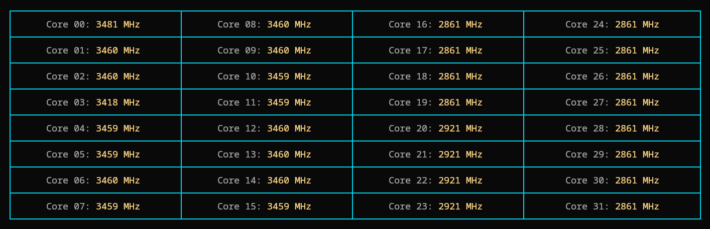
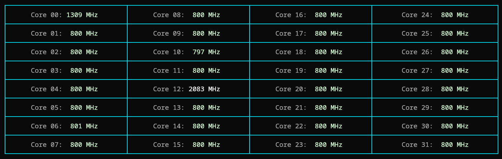

# Cpumon

Cpumon is a simple tool to monitor the frequency of every core of a CPU.

## Screenshots




## Usage

```sh
pnpm install
```
```sh
node cpumon.js <delay>
```

The `<delay>` parameter controls how often the program updates the frequency value.
It's useful down to around 100ms.
